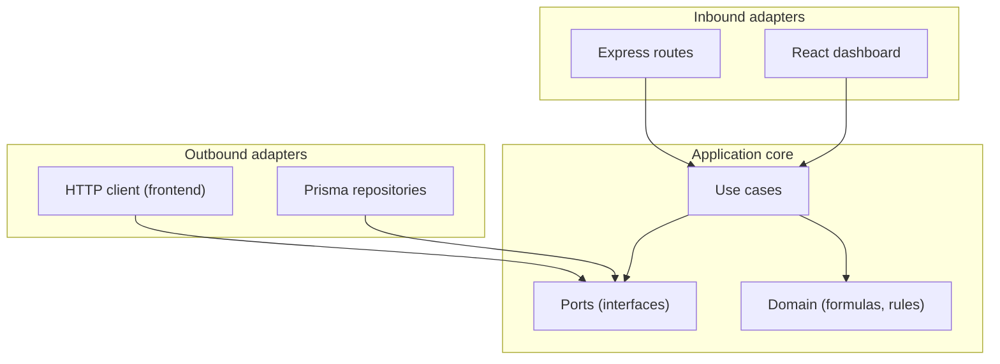
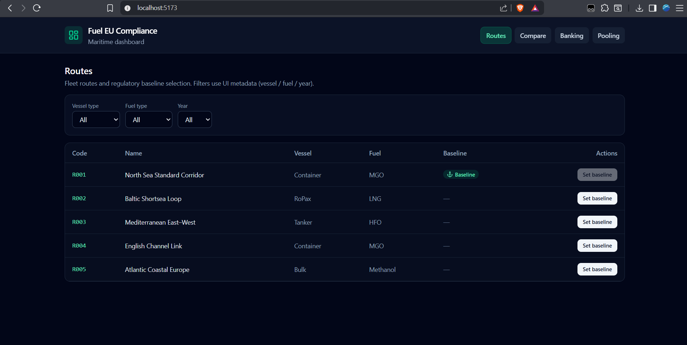
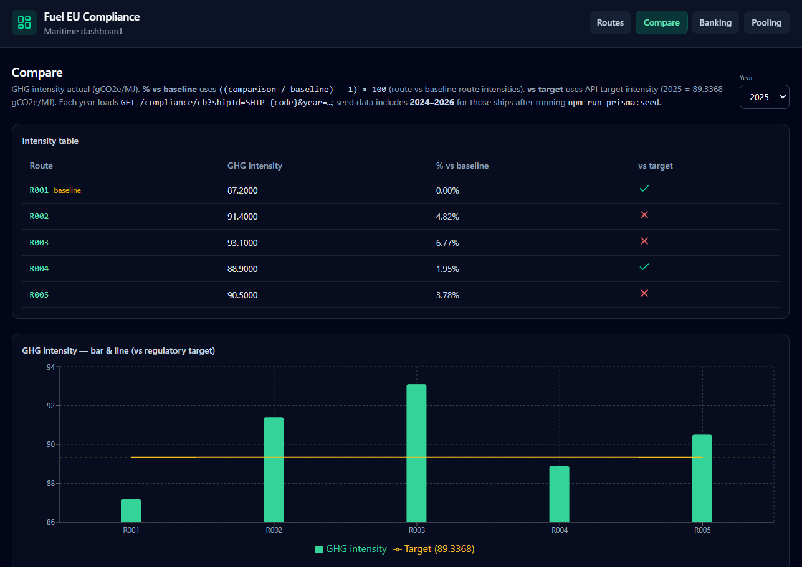
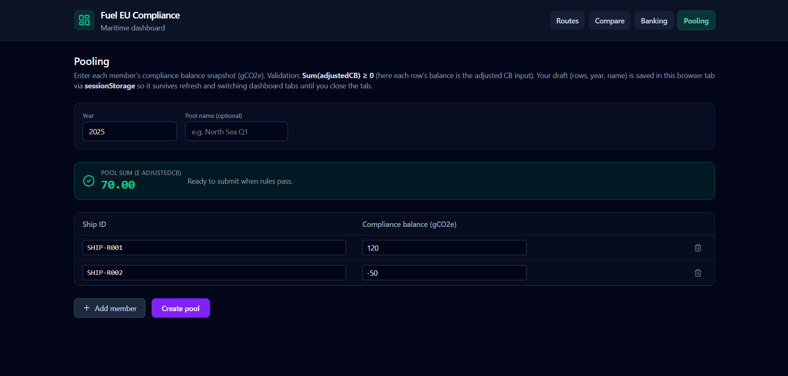

# Fuel EU Maritime — Assignment

Monorepo: **backend** (Node.js, TypeScript, Express, Prisma, PostgreSQL) and **frontend** (React, TypeScript, Vite, Tailwind). Both apps use a **hexagonal** layout (ports and adapters).

## Architecture (hexagonal)

Dependencies point inward: **domain** and **application** (use cases) depend on **ports** (interfaces). **Adapters** connect the outside world to those ports—inbound (HTTP, React UI) and outbound (Prisma, HTTP client). **Infrastructure** composes concrete implementations at startup (Express app, database).



| Layer | Backend | Frontend |
|-------|---------|----------|
| Domain | `src/core/domain` | `src/shared` (formulas aligned with API) |
| Application | `src/core/application` | Tab-level UI logic |
| Ports | `src/core/ports` | `src/core/ports` (`FuelEuApiPort`) |
| Adapters | `src/adapters` — HTTP, Prisma | `src/adapters` — UI, HTTP adapter |
| Composition | `src/infrastructure/server` | `App.tsx` + providers |

## Requirements

- **Node.js** 20+
- **npm** 10+ (or compatible)

## Project layout

| Path | Role |
|------|------|
| `backend/` | REST API, Prisma, FuelEU compliance domain; wiring under `src/infrastructure` |
| `frontend/` | React SPA (Vite); UI under `src/adapters/ui` |

Shared conventions (both apps): `src/core/domain`, `src/core/application`, `src/core/ports`, `src/adapters`, `src/shared`. The backend adds `src/infrastructure` for server bootstrap and DB.

### Core formulas (project spec)

Implemented in `backend/src/core/domain` and reflected in the UI where applicable.

| Quantity | Definition |
|----------|------------|
| Target intensity (2025) | **89.3368** gCO2e/MJ (`year === 2025`) |
| Energy in scope (MJ) | Fuel (t) × **41,000** |
| Compliance balance (gCO2e) | **(Target − Actual) × Energy** — positive surplus, negative deficit |
| Compare vs baseline route | **((comparison / baseline) − 1) × 100** on GHG intensity (gCO2e/MJ) |
| Pooling | Feasible when **Sum(adjusted CB) ≥ 0** |

Regulatory scope is limited to these assignment formulas (not full FuelEU WtW / penalty machinery).

## Backend

### Database

1. Copy `backend/.env.example` to `backend/.env` and set `DATABASE_URL`.
2. Start PostgreSQL (e.g. `docker compose -f backend/docker-compose.yml up -d`).
3. `cd backend && npx prisma migrate deploy`
4. Seed data: `npm run prisma:seed` (routes R001–R005, ships `SHIP-R001`…`SHIP-R005`, compliance **2024–2026**).

### Run API

```bash
cd backend
npm install
npm run dev
```

```bash
npm run test
```

| | |
|--|--|
| Default port | **3000** (`PORT`) |
| Health | `GET /health` |
| Routes | `GET /routes`, `POST /routes/:id/baseline` (`id` = route id or code, e.g. `R001`) |
| Compliance | `GET /compliance/cb?shipId=&year=` |
| Banking | `POST /banking/bank`, `POST /banking/apply` — body `{ "shipId", "year", "amount" }` |
| Bank balance | `GET /banking/balance?shipId=&year=` → `{ "balance" }` |
| Pools | `POST /pools` — body `{ "year", "name"?, "members": [{ "shipId", "complianceBalance" }] }` |

```bash
npm run build
npm run lint
npm run format
```

## Frontend

Dashboard (**Tailwind**, **Lucide**, **Recharts**) talks to the API via `src/adapters/infrastructure/fuel-eu-http.adapter.ts` (`FuelEuApiPort`). Dev server proxies **`/api/*`** → `http://localhost:3000` (`frontend/vite.config.ts`); default base URL is `/api`. Optional: `VITE_API_BASE_URL` in `frontend/.env` (see `.env.example`).

```bash
cd frontend
npm install
npm run dev
```

```bash
npm run test
```

**Tabs:** Routes · Compare · Banking · Pooling. Compare uses `GET /compliance/cb` per route ship and year (seed covers 2024–2026). Pooling draft state is kept in **sessionStorage** until **Create pool** submits to the server.

```bash
npm run build
npm run lint
npm run format
```

## Screenshots

| | |
|--|--|
| Overview |  |
| Compare |  |
| Pooling |  |
