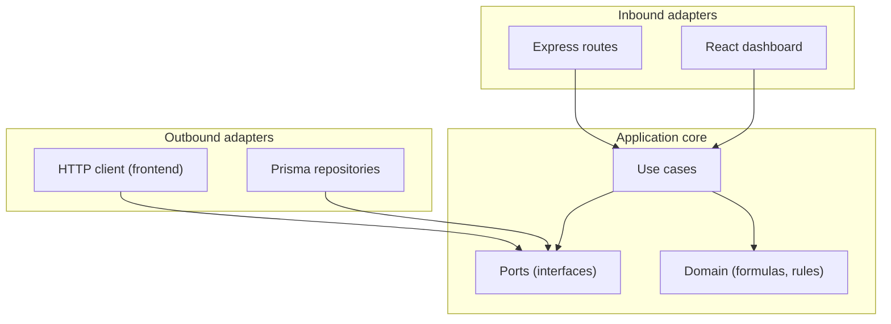

# Fuel EU Maritime — Assignment

Full-stack **Fuel EU Maritime** exercise: **backend** (Node.js, TypeScript, Express, Prisma, PostgreSQL) and **frontend** (React, TypeScript, Vite, Tailwind). Both apps use **hexagonal** structure (ports and adapters).

## Repository (submission)

**https://github.com/Rajneesh26D/fueleu-maritime-assignment**

Use that link when submitting. On GitHub, the **About** box can summarize the repo, for example:

> Full-stack Fuel EU Maritime assignment — hexagonal architecture, Prisma API, React dashboard (Routes, Compare, Banking, Pooling), tests and CI.

Suggested topics: `typescript`, `react`, `vite`, `nodejs`, `express`, `prisma`, `postgresql`, `tailwindcss`.

## What this project includes

| Area | Delivered |
|------|-----------|
| **Architecture** | Hexagonal layout in `backend/` and `frontend/` (domain, application, ports, adapters; backend `infrastructure` for wiring). |
| **Backend** | REST API per assignment brief: routes (+ optional `?year=` KPI merge), **`GET /routes/comparison`**, compliance (`/compliance/cb`, **`/compliance/adjusted-cb`**), banking (**`/banking/records`**, bank, apply, balance), **`POST /pools`** with greedy allocation, **member `cb_before` / `cb_after`**, transfers. Prisma: routes, ship compliance, bank ledger, pools + members. |
| **Frontend** | Dashboard: **Routes** (KPI table via `GET /routes?year=…`), **Compare** (`GET /routes/comparison`), **Banking** (CB, adjusted CB, ledger records), **Pooling** (create pool + member outcomes). `FuelEuHttpAdapter` / `FuelEuApiPort`; dev `/api` proxy. |
| **Formulas** | 2025 target intensity **89.3368** gCO2e/MJ; energy = fuel (t) × **41,000** MJ; CB = (T−A)×E; compare % = ((comparison/baseline)−1)×100; pooling feasibility and greedy pairing per spec. |
| **Data** | Seed aligns with the brief’s KPI table where defined (e.g. R001–R003 @ 2024, R004–R005 @ 2025); other year×route pairs use defaults. Ships **SHIP-R001…SHIP-R005**, years **2024–2026**. |
| **Quality** | TypeScript **strict**, ESLint + Prettier; **Vitest** unit tests (domain + use cases + Supertest HTTP mocks); frontend tests (comparison formula + dashboard shell). |
| **CI** | GitHub Actions: `npm run lint`, `npm run test`, `npm run build` in `backend/` and `frontend/` on push and pull requests. |
| **Docs** | This README; `REFLECTION.md` (process); `AGENT_WORKFLOW.md` (phased work and tooling notes). |

## Architecture (hexagonal)

Dependencies point inward: **domain** and **application** (use cases) depend on **ports** (interfaces). **Adapters** connect the outside world to those ports—inbound (HTTP, React UI) and outbound (Prisma, HTTP client). **Infrastructure** composes concrete implementations at startup (Express app, database).



| Layer | Backend | Frontend |
|-------|---------|----------|
| Domain | `src/core/domain` | `src/shared` (formulas aligned with API) |
| Application | `src/core/application` | Tab-level UI logic |
| Ports | `src/core/ports` | `src/core/ports` (`FuelEuApiPort`) |
| Adapters | `src/adapters` — HTTP, Prisma | `src/adapters` — UI, HTTP adapter |
| Composition | `src/infrastructure/server` | `App.tsx` + providers |

## Requirements

- **Node.js** 20+
- **npm** 10+ (or compatible)

## Project layout

| Path | Role |
|------|------|
| `backend/` | REST API, Prisma, FuelEU compliance domain; wiring under `src/infrastructure` |
| `frontend/` | React SPA (Vite); UI under `src/adapters/ui` |

Shared conventions (both apps): `src/core/domain`, `src/core/application`, `src/core/ports`, `src/adapters`, `src/shared`. The backend adds `src/infrastructure` for server bootstrap and DB.

### Core formulas (project spec)

Implemented in `backend/src/core/domain` and reflected in the UI where applicable.

| Quantity | Definition |
|----------|------------|
| Target intensity (2025) | **89.3368** gCO2e/MJ (`year === 2025`) |
| Energy in scope (MJ) | Fuel (t) × **41,000** |
| Compliance balance (gCO2e) | **(Target − Actual) × Energy** — positive surplus, negative deficit |
| Compare vs baseline route | **((comparison / baseline) − 1) × 100** on GHG intensity (gCO2e/MJ) |
| Pooling | Feasible when **Sum(adjusted CB) ≥ 0** |

Regulatory scope is limited to these assignment formulas (not full FuelEU WtW / penalty machinery).

## Backend

### Database

1. Copy `backend/.env.example` to `backend/.env` and set `DATABASE_URL`.
2. Start PostgreSQL (e.g. `docker compose -f backend/docker-compose.yml up -d`).
3. `cd backend && npx prisma migrate deploy`
4. Seed data: `npm run prisma:seed` (routes R001–R005, ships `SHIP-R001`…`SHIP-R005`, compliance **2024–2026**).

### Run API

```bash
cd backend
npm install
npm run dev
```

```bash
npm run test
```

| | |
|--|--|
| Default port | **3000** (`PORT`) |
| Health | `GET /health` |
| Routes | `GET /routes` (optional `?year=` → KPI + compliance columns), `POST /routes/:id/baseline` |
| Compare | `GET /routes/comparison?year=` → `percentDiff`, `compliant`, intensities |
| Compliance | `GET /compliance/cb?shipId=&year=` (persists snapshot); `GET /compliance/adjusted-cb?shipId=&year=` (CB after bank ledger) |
| Banking | `GET /banking/records?shipId=&year=`; `POST /banking/bank`, `POST /banking/apply`; `GET /banking/balance?shipId=&year=` |
| Pools | `POST /pools` → `members[]` with `cbBefore` / `cbAfter`, `transfers`, `surplusRemainingGco2e` |

**Sample requests** (with API running on port 3000):

```bash
curl -s "http://localhost:3000/routes/comparison?year=2025"
curl -s "http://localhost:3000/compliance/adjusted-cb?shipId=SHIP-R001&year=2025"
curl -s "http://localhost:3000/banking/records?shipId=SHIP-R001&year=2025"
curl -s "http://localhost:3000/routes?year=2024"
```

```bash
npm run build
npm run lint
npm run format
```

## Frontend

Dashboard (**Tailwind**, **Lucide**, **Recharts**) talks to the API via `src/adapters/infrastructure/fuel-eu-http.adapter.ts` (`FuelEuApiPort`). Dev server proxies **`/api/*`** → `http://localhost:3000` (`frontend/vite.config.ts`); default base URL is `/api`. Optional: `VITE_API_BASE_URL` in `frontend/.env` (see `.env.example`).

```bash
cd frontend
npm install
npm run dev
```

```bash
npm run test
```

**Tabs:** Routes (metrics when a calendar year is selected) · Compare (`/routes/comparison`) · Banking (CB, adjusted CB, `/banking/records`) · Pooling. Pooling draft uses **sessionStorage** until **Create pool**.

```bash
npm run build
npm run lint
npm run format
```

## Screenshots

| | |
|--|--|
| Overview |  |
| Compare |  |
| Pooling |  |

## Further reading

| File | Contents |
|------|----------|
| `REFLECTION.md` | Reflection on collaboration and engineering choices |
| `AGENT_WORKFLOW.md` | Phased delivery log and tooling notes |
